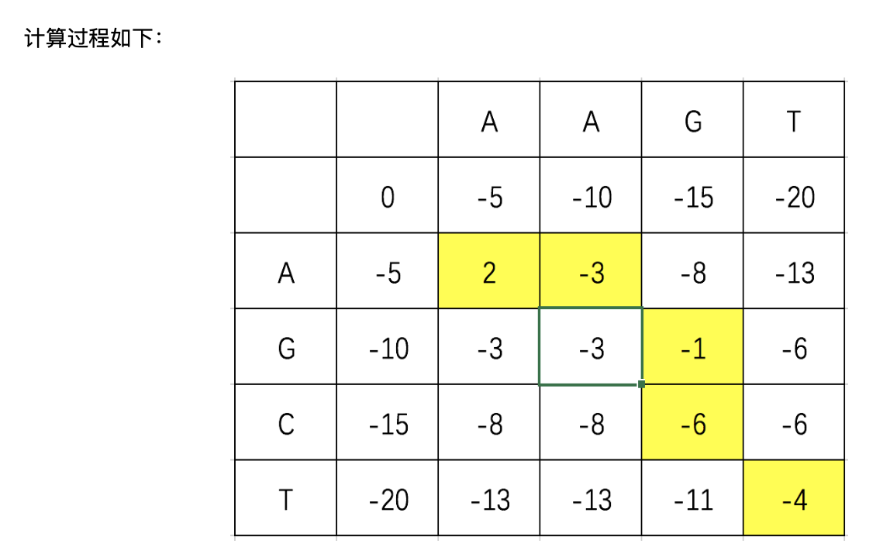
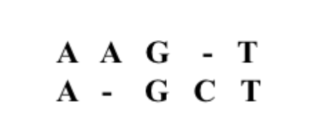
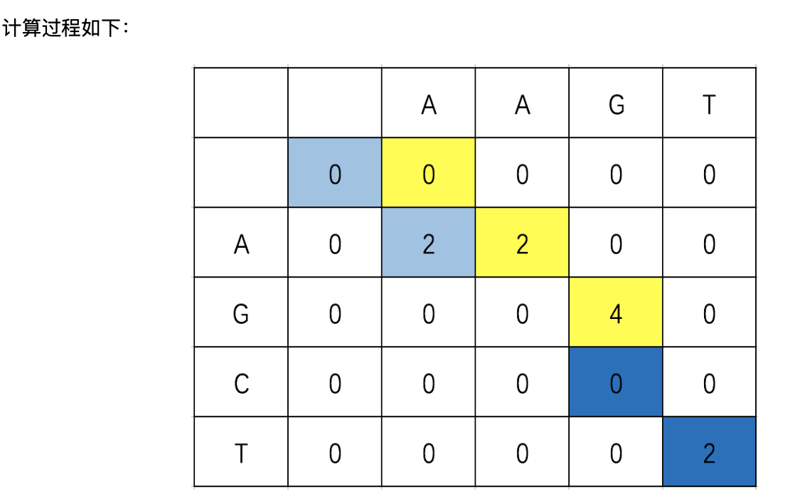

## 第13题 从双序列比对开始学起
Hello 大家好！

经过我们之前的12个问题，我们对Illumina 测序的原理，测序的储存模式，测序数据的质控已经有了一个比较清楚的认识。那么我们今天就开始用接下来的若干次提问来学习与比对有关的知识。

比对其实应该对应的单词是alignment，但往往特指低通量的序列之间的比较。

比如10条序列，进行多序列比对就是我们常说的 multiple alignment问题；

如果是2条序列的比对，我们经常称其为pairwise alignment.

**回贴通常对应的单词应该是mapping，** 一般指高通量的数据去寻找基因组的位置。

比如我们进行测序以后，有10M对read pair，要去寻找他们在基因组上的位置，这个时候就是一个典型的mapping问题。

alignment与mapping其实是密切相关的概念，所有的mapping软件其实都是从低通量的办法逐步改进而得到的。

今天我们的问题是，请各位学习一下北京大学高歌老师的《生物信息学：导论与方法》中的双序列比对（pairwise alignment）的相关算法。主要是Needleman-Wunsch算法（全局比对）和Smith-Waterman算法（局部比对）相关的内容，然后回答下面的问题。

每个视频长度都不长，希望大家认真看完！今天的内容是以后的基础，如果学不好，以后的高楼盖得再高，也有轰然倒塌的那一天！

课程视频的链接如下：

[生物信息学：导论与方法(北京大学)-序列比对中的基本概念](https://www.bilibili.com/video/av10042290/?p=5)

[生物信息学：导论与方法(北京大学)-利用动态规划进行全局序列比对](https://www.bilibili.com/video/av10042290/?p=6)

[生物信息学：导论与方法(北京大学)-从全局比对到局部比对](https://www.bilibili.com/video/av10042290/?p=7)

今天的问题：

如果我们假设比对的 scoring matrix 如下图1所示，同时gap的罚分d= -5


图1 序列比对的scoring matrix

假设我们的 seq1 = AAGT，seq2=AGCT；那么我们进行双序列比对，需要填写下面的表格。

---

**1. 使用Needleman-Wunsch算法（全局比对），那么表1应该怎么填写？最终的比对结果是什么？**



​ 最终比对结果为：



**2. 使用Smith-Waterman算法（局部比对），那么表1应该怎么填写？最终的比对结果是什么？**



```
注意:在进⾏行行局部⽐比对回溯的时候，需要从第1个⾮非零的碱基开始，沿对⻆角线⽅方向到第1个遇到0的结果为⽌止。因 此本题中，局部⽐比对的结果有3个:
第1个结果是(浅蓝⾊色):
A
A
第2个结果是(⻩黄⾊色):
AAG
A-G
第3个结果是(深蓝⾊色):
T
T
```
**3. 请思考，为什么有的时候需要全局比对，有的时候需要局部比对？**
```
全局⽐比对，是从头到尾对序列列的每⼀一个碱基都进⾏行行⽐比对，找到最优解;
局部⽐比对，是为了了找到两条序列列中最相似的部分，可以有多个结果;

全局⽐比对能找到2条序列列⽐比对的最优解，⽤用处很⼤自不不必说，单独说说局部⽐比对的相关意义与必要性。

随着越来越多的序列列信息的产⽣生，⼈人们发现对于:
1.某些蛋⽩白序列列虽然整体相差很⼤大，但是对于某些特殊的功能域却有着极⾼高的相似性;
2.⽽且在不不同物种中序列列和功能都相当保守，这在全局⽐比对中是很难发现的;
3.另一⽅面随着70年年代内含⼦子的发现⽐比对算法必须要能够处理理由于内含⼦导致的⼤大⽚片段的差异
```
