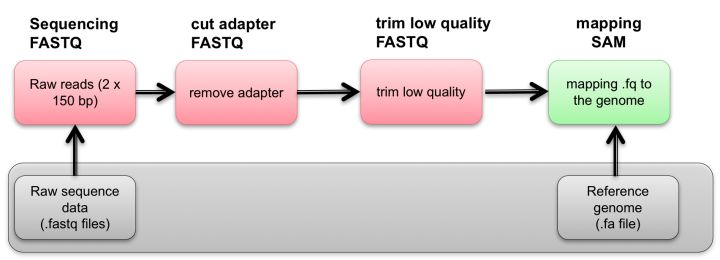

## 第16题 高通量测序的回贴问题 I
Hello大家好！我们又见面了！

在这之前，我们一直在讨论怎么去做FASTQ文件的质控，怎么trim，怎么cutadapt；还为大家介绍了从双序列比对的最根本的原理及算法；再到后来学习了低通量的找相似序列的办法BLAST以及基因组快速定位的办法BLAT。那么从今天开始以后的若干问都是与高通量测序结果的回贴（mapping）问题有关。

首先来看一下技术路线图：


从FASTQ到SAM路线图

我们的核心任务是从FASTQ文件开始，经过中间的质控，最终找到序列在基因组上的定位。

那么，我们之前的算法和方法能不能高效完成这个问题呢，答案是不行的！因为这次我们的输入常常是10^7 甚至更多的reads，而且是要在全基因组上寻找定位，比如人的基因组有3Gbp大！所以如果不优化算法，估计mapping这个问题就要等到地老天荒。关于mapping的算法问题，我之前录过1期视频，专门推导了为什么应用BWT算法就可以完成我们这项艰巨的任务。

[踏踏实实做技术：BWA，Bowtie，Bowtie2的比对算法推导](https://zhuanlan.zhihu.com/p/30485711)

---

谈完了算法，我们再谈谈比对软件。目前市面上针对DNA测序的结果mapping的比对软件有很多。针对2代测序优化过的，最常用的有Bowtie，Bowtie2，BWA这三款；针对3代测序优化的比对软件有BLASR，LAST，BWA-MEM等等。因为目前二代测序占据了90%以上的市场份额，因此我们前期主要讨论的内容是二代测序的比对问题，也就是Bowtie，Bowtie2，BWA这三款软件。

其实，看过我上面BWT推导的朋友应该能够知道，这三个软件本质上的算法是没有区别的，有区别的地方都是小修小改。所以上，理解了其中的1个，其他的也都很好理解。我们会发现，这些算法的最基础的要点就是都要有1个index。

那么什么是index呢？简单来说就是若干个文件，方便我们快速地访问及搜索基因组。上面我说的这些比对软件都需要建立index。

一般建立index的输入文件为参考基因组序列（FASTA格式）和1个我们指定的index-name；输出为若干个以index-name为开头的index文件。比如我们使用Bowtie2，以human reference genome建立index的命令为：
```
# build-index by Bowtie2
> bowtie2-build hg19_only_chromosome.fa  hg19_only_chromosome &

# 解释
#### bowtie2-build为建立index的命令，安装bowtie2以后就可以用；
#### hg19_only_chromosome.fa 为human genome的参考基因组，FASTA格式；
#### hg19_only_chromosome 为建立index需要指定的名称；
```
最终建立index输出结果如图2：


使用bowtie2建立的human genome index

**1. 为什么FASTQ文件的快速比对需要建立index？**
```
主要是为了加快比对速度，Index简单来说就是若干个文件，方便程序快速地访问及搜索基因组；
在Index的帮助下，比对软件可以把序列比对的问题的时间复杂度降低
```
**2. 如果我从1个网站上下载的是1个物种的参考转录组的序列，其中包含了A,U,C,G碱基，我的FASTQ为该物种转录组测序的结果，用A,G,T,C，4种碱基来表示。那么需不需要在建立index之前把参考转录组中的U全部都换成T？**
```
需要转化，因为比对程序并不能将U直接识别为T
```
**3. 请在Linux环境下，下载human genome 19参考基因组的1号染色体序列；并使用bowtie 建立index。**
```
weget -c -o ./test http://hgdownload.soe.ucsc.edu/goldenPath/hg19/chromosomes/ch r1.fa.gz &
# -o，将⽂文件下载到指定⽬目录中
# -c，断点传续
# &,后台运⾏行行
```
下载得到的⽂文件为 chr1.fa.gz，压缩格式，解压⽂文件
```
gzip -d ./test/chr1.fa.gz
```
解压得到chr1.fa，下⼀一步建⽴立Index
```
bowtie2-build ./test/chr1.fa ./test/chr1_bowtie2_index &
```
得到 chr1_bowtie2_index.bt2 ，注意，调⽤用index时使⽤用的名字为 chr1_bowtie2_index

我用的是整合在一起的hg19_genome.fa，以下是命令和生成结果
```
bowtie2-build hg19_genome.fa hg19_genome_bowtie2_index &
```

