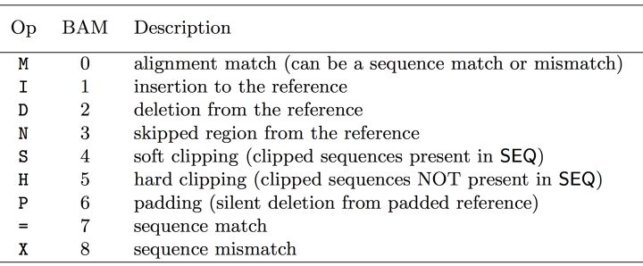

## 第19题 SAM/BAM中的CIGAR值
Hello大家好！我们又见面了！

今天我们来和大家一起继续学习SAM/BAM文件的文件结构与特性。

我们之前学习到了从SAM文件是用来存储序列mapping结果的标准格式，BAM文件是SAM文件的压缩格式，二者在信息层面是等价的。

SAM/BAM文件的前面5列，分别记录了，各位可以对照下图1中的内容对应一下。
```
1. 序列的名称；
2. FLAG值；
3. 比对到的染色体；
4. 比对到的染色体的具体位置；
5. 比对的质量值， 也叫MAPQ；
```

图1 全基因组测序的比对数据

那么第6列信息到底是什么呢？它其实是比对的一个简单描述，有一个很好听的名字叫CIGAR值（对滴，就是雪茄烟的那个单词）。

>CIGAR = Concise Idiosyncratic Gapped Alignment Report

我们先来简单理解一下CIGAR值。
```
例子1：如图1第37行，CIGAR = 56M1I30M；
它的含义就是：这条序列与参考基因组相比；
前56bp能够match上；
中间有1bp的insertion（相比于参考基因组有1bp的插入）；
最后是30bp的match

例子2：如图1第50行，CIGAR=145M，
含义就是：这条序列与参考基因组比对的结果是145bp完全match上。
```
那么常用的CIGAR标记符号都有哪些呢？根据SAM格式的官方文档如图2所示。


表1 常用的CIGAR符号

目前，我们只需要了解到前面7个，后面的=，X已经很不常用了，大家可以先忽略一下。

我们今天就是让大家去理解CIGAR值到底是什么，因此我们今天的问题就是：

**1. M,I,D,N分别是什么意思？如果1条序列的CIGAR=150M， 那么是不是可以说这150bp的区域中没有mismatch（错配）的现象？**
```
M:序列列匹配或错配
I:参考序列上的插入
D:参考序列上的缺失
N:参考序列上的跳跃区 150M不能说150bp区域区域中没有错配，因为M表示完全匹配; 但是⽆论reads与序列的正确匹配或是错误匹配该位置都显示为M 。
```
**2. 如果1条序列来自于成熟的mRNA，在mapping到基因组的时候会有什么问题？如果这条序列中间正好跨过了200bp的intron，前后各有75bp mapping到了exon上，那么这条序列的CIGAR值应该怎么写？**
```
- 错配，intron,跳跃区;
- CIGAR:75M200N75M
```
**3. 根据下图提示，请理解clip的含义，无论是softclip还是hardclip。**


引自http://bioinformatics.cvr.ac.uk/blog/tag/cigar-string/

```
以r003序列为例，两个比对结果中序列剪切之后进行比对，那么所对应的CIGAR分别是5S6M和6H14N5M;
最终bam文件中序列分别是11bp和25bp,
这说明，在read进行softclip后，reads的原始信息在BAM文件中依然保留;
但是hardclip中，reads只在BAM文件中保留了切除以后的序列将直接被删除。
```
