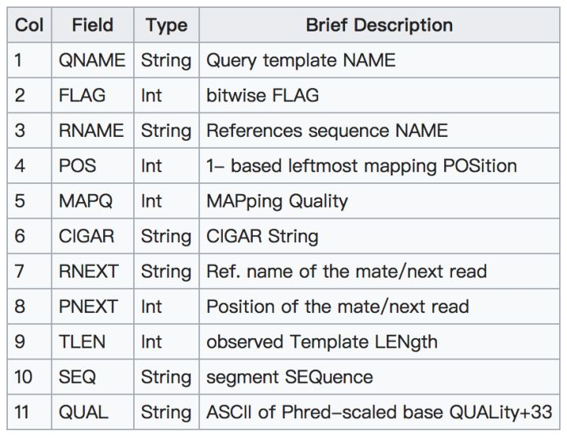

## 第20题 SAM/BAM中的其它重要信息列
Hello大家好！今天我们又见面了！

今天我们来继续探索SAM/BAM文件的信息列。

我们之前已经说过，1个标准的SAM文件包含前面的11列标准信息列和若干标识符信息列（如表1所示），其中前面的6列我们已经为大家解释清楚。那么今天我们来继续探索剩下的7到11列。


表1 SAM格式的标准11列信息介绍

第7列，一般情况下是指Pair read的另一半的比对的参考基因组；

第8列，一般情况下是指Pair read的另一半的比对的参考基因组的坐标；

第9列，可以简单理解为这1对read比对到基因组上以后，上游第1个碱基到下游最后1个碱基的距离。如果用负号表示是下游的序列；如果是正数表示为上游的序列；如果是0表示只是单端比对上；

第10列，进行比对read的序列信息；

第11列，进行比对read的质量信息；


对于我们今天的简单讲解，其实还涉及到很多概念，就比如在SAM官方文档中，对template，segment，read的各自定义就很让人挠头，我也是用了很长的时间才弄懂学会的。大家有兴趣的可以看一下图2我的截图，看看里面的定义。


那么我们今天的问题如下：

**1. 图1中第20行，第9列记录了TLEN值，请你根据今天的文章与图1中的信息，列出算式计算TLEN值。**

TLEN是Template的观测长度length

第二十行关键内容如下：
```
第四列：11123 # mapping的位置开端
第六列：145M # CIGAR
第八列：10946 # pair reads中与该序列配对的read所mapping到参考序列的具体位置
第九列：-322 # 通过分析pair reads mapping到同一条参考序列上位置的推断得到fragment的长度
image-20200215120747953
```

-(11123-10946+145) = -322


**2. 如果使用FASTA文件作为input，第11列的质量值是否还有意义？为什么？**

没有意义，因为fasta⽂文件信息不不包含read的质量量值，11列列的质量量值本身是测序质量量值，所以没有参考意义。

**3. 有没有可能通过SAM文件，提取里面的序列信息并转换成FASTQ格式的文件？如果可能，请你写出程序思路。**
```
samtools view -b -h -S filter_MAPQ20.sam > filter_MAPQ20.bam
samtools bam2fq filter_MAPQ20.bam > filter_MAPQ20.fastq
# [M::bam2fq_mainloop] processed 629 reads

```

[该问题参考资料-bam to fq](http://www.metagenomics.wiki/tools/samtools/converting-bam-to-fastq)
