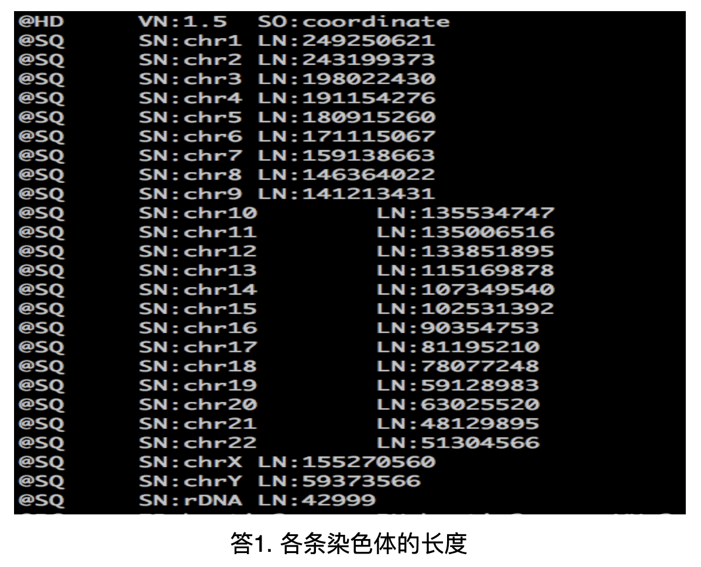
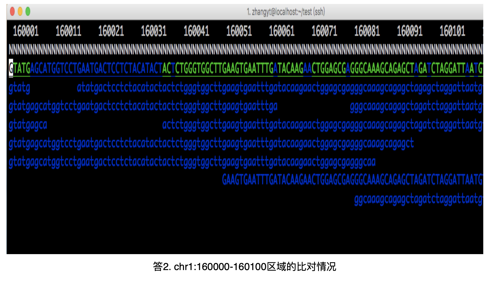

## 第22题 都有了SAM文件，为什么还需要BAM文件？
Hello 大家好！

前面的若干问题，我们一直在围绕着SAM文件的记录格式做了详细地讨论，我相信大家通过我们的问题，跟随我们学习的思路已经掌握了SAM文件作为标准的比对格式的合理性以及相关特点。

### 1. 背景介绍和数据下载
SAM文件不但记录了reads详细的mapping信息，还记录了reads的原始信息，内容很是全面。这样很好，但也存在很多问题：

1. 比如我的原始FASTQ文件是100G，那么我的SAM文件一定是大于100G的，也就是占用了更多空间；
2. mapping的结果是没有排序，无论是按reads 的 name排序还是按在基因组上的位置排序，都没有。所以默认的SAM输出文件是乱序的，处理很不方便；
3. mapping的结果不能进行随机访问，什么是随机访问呢？举个例子就是说对于一个SAM文件我不能快速地访问比如chr1 10000 - 200000 这个区域的所有reads 的mapping情况。

基于以上这3个问题，BAM文件就出现了，并且完美解决了上面3个问题。为了方便我们今天的展示和说明，我为大家准备了1个很小的SAM文件，大约只有4MB，请大家下载下来并完成我们的相关问题。
```
# SAM测试文件的baidu盘下载地址
链接：https://pan.baidu.com/s/15gVVYPRu3VbF_uKbJUUGrA 密码：2drn
```
同时，我们今天要使用的工具是Linux下的samtools，请没有Linux的老铁去安装Linux（我们马上就会有教程出来）；请没有安装samtools软件的老铁使用conda安装需要软件，教程可以移步([用Anaconda快速搭建生物信息学分析平台](https://zhuanlan.zhihu.com/p/35711429))

### 2. 思路讲解
BAM文件是SAM文件的一种压缩格式，也是最常用的一种比对结果的压缩格式。它一般可以将SAM文件压缩到只有原来的20~30%大小，并且使用非常方便。

同时，对于BAM文件，我们一般还会进行排序，根据不同的需要，我们排序的方法一般有2种：第1种是按照mapping到的参考基因组的坐标上下游顺序来排序，是samtools的默认排序方法；第2种是按照reads name进行排序，需要增加一个-n参数。

对于一个已经排序好的BAM文件，我们通常会建立索引文件，后缀名一般是在BAM文件名的后面多个“.bai“。有了BAM以及索引文件的出现，我们就可以随机访问任意一段染色体区域的BAM文件。

### 3. 提出问题
那么我们今天的问题也很简单，就是使用samtools工具对我们的测试数据test.sam文件进行操作。具体要求如下：

**1. 使用samtools view 命令查看test.sam的header，请记录各条染色体的长度；同时告知这个test.sam文件是使用哪种mapping软件进行mapping的？**
```
看header中的@PG ID，显示使用的mapping软件是bowtie2，header中显示各条染⾊体的长度如下图:
```


**2. 使用samtools view命令将test.sam文件转换成test.bam文件，并保留header区域，写出命令并记录test.sam，test.bam的文件大小。**
```
使用的命令如下:( -b:输出文件为bam格式; -h,输出中包含header信息)
samtools view -b -h test.sam > test.bam

结果显示test.sam⽂件大小是3.9M，而test.bam文件则是660K，bam⽂文件会小很多;
```
**3. 使用less命令分别查看test.sam，test.bam文件，为什么bam文件会输出乱码？使用samtools view命令再试试看？**
```
 less命令可以正常查看sam文件，但是不能正常查看bam⽂文件，因为bam文件是二进制文件，所以需要使用
 samtools view test.bam来查看bam文件。
 ```
**4. 使用samtools sort命令对test.bam文件进行排序，输出文件名为test_sort.bam，并记录文件大小。**

首先解释一下samtools sort命令:

```
sort命令的使用:
samtools sort [-l level] [-m maxMem] [-o out.bam] [-O format] [-n] [-T tmpprefix] [-@ threads] [in.sam|in.bam]
参数:
-l INT 设置输出文件压缩等级。0-9，0是不压缩，9是压缩等级最高。不设置此参数时，使用默认压缩等级;
-m INT 设置每个线程运行时的内存大小，可以使用K，M和G表示内存大⼩。
n 设置按照read名称进行排序;
-o FILE 设置最终排序后的输出文件名;
-T PREFIX 设置临时文件的前缀;
-O FORMAT 设置最终输出的文件格式，可以是bam，sam或者cram，默认为bam;
-@ INT 设置排序和压缩是的线程数量，默认是单线程。
```
```
对test.bam进行排序，不压缩，默认线程，设置最终输出名称为test_sort.bam，
默认临时文件前缀，默认输出bam文件，默认单线程;
使⽤用命令如下:
samtools sort -o test_sort.bam test.bam
结果显示 test.bam 660K; test_sort.bam 660K 也就是排序之后的bam⽂件⼤小不变。
```
**5. 使用samtools index 对test_sort.bam建立index，写出命令并记录其文件大小。**
```
samtools index [-bc] [-m INT] <in.bam> [out.index]
参数:
-b 创建bai索引⽂献(默认);
-c 创建csi索引⽂献;
-m INT 创建csi索引⽂献，最小间隔值2^INT;

> samtools index test_sort.bam > ls -hs
结果: test_sort.bam.bai 4.0K
```
**6. 使用samtools tview使用下面的命令查看chr1:160000-160100区域的比对情况，并截图**
```
samtools tview -p chr1:160000-160100  test_sort.bam

```

### 4. 参考资料
[资料1]：本次主要是对samtools的一个应用，我建议大家直接看samtools的说明文档，比如对于view功能，直接在命令行敲击samtools view，再按回车就能出现说明文档。       
[资料2]：[samtools manual page](http://www.htslib.org/doc/samtools.html)
