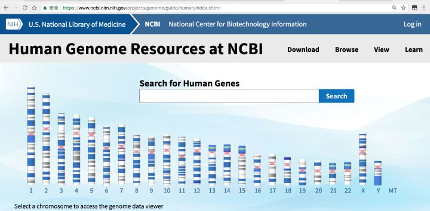
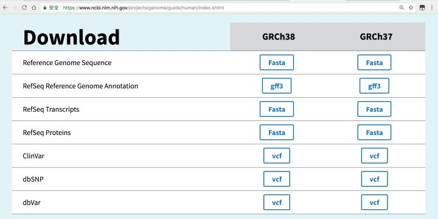

## 第26题 什么是RefSeq Gene? 怎么给NCBI反馈问题？
Hello 大家好，我们又见面了！

昨天我们给大家介绍了怎么下载GTF/GFF文件，并让大家尝试使用2种方法分别从UCSC genome browser上下载RefSeq Gene GTF（hg19版本）；以及Ensembl网上下载Ensembl Gene GTF（hg19版本），还在最后的提问环节让大家比较了一下这两者的不同。

### 1. 常用的Gene注释
其实，常用的gene注释有不同的来源，这个来源一般是某一个组织通过一定的方法来确定下来的参考gene的相关注释信息。比如常用的有：

* **RefSeq Gene注释**，对gene的不同转录本进行注释，1个转录本对应1个编号成为RefSeq id，例如对于可以翻译成蛋白的转录本，都会以NM_开头如NM_015658；对于不能翻译的转录本，都会以NR_开头如NR_027055；
* **Ensembl注释；**对gene的不同转录本进行注释，以ENSG开头的表示Ensembl gene_id如ENSG00000227232，以ENST开头的表示Ensembl transcript id如ENST00000438504
* **UCSC gene注释；**对gene的不同转录本进行注释，一般是类似uc004cpf这样的名称。

针对1个参考基因组版本，比如human的hg19参考基因组版本，会有来自各种不同组织，不同方法的基因注释。这些基因注释各有优劣，没有绝对的好与绝对的坏，只有掌握他们的注释规则，才能找到最适合我们课题的基因注释。所以，我们今天先来介绍一下RefSeq Gene的注释规则与原理。

### 2. RefSeq 计划与RefSeq gene
RefSeq = The NCBI Reference Sequence

这个计划是由NCBI提出的，意图是为所有常见生物提供非冗余，人工选择过的参考序列。一个物种的RefSeq注释通常包含：参考基因组，参考转录组，参考蛋白序列，参考SNP信息，参考CNV信息等等。

RefSeq基本上我们最常用的一个gene注释版本了，因为经过了人工挑选，挑选出来的gene或者是转录本都十分可靠。在RefSeq的官方说明文档中，这么写了一句话 “It is a unique resource because it provides a large, multi-species, *curated* sequence database.” 这个curated是什么意思，大家可以查查字典~

从RefSeq的官方网站上可以下载到N个物种的参考序列信息，从无核到有核，从原核到真核，从低等到高等应有尽有。不过呢，这里面还是human的信息注释得最为全面，并且在RefSeq的主页上做了单独的页面链接

页面中的Human Genome Resource and Download就可以进入Human资源的专题页面，如图2-1，图2-2所示。

图2-1 Human Genome Resource and Download页面上半部分

图2-2 Human Genome Resource and Download页面的download部分

页面的下半部分就是download的信息，其中提供了两个版本的资源，GRCh38 = hg38， GRCh37 = hg19。不过，我们注意一下，这里的基因注释文件为GFF3.0版本，和GTF（GFF2.0版本）略有不同，但里面的信息等价，也可以作为参考文件提供给比对软件。

### 3. 提问环节
\1. 请点开RefSeq的官方主页，随便点一点里面的内容，探索一下每个链接对应的内容是什么；

\2. 尝试下载hg19的GFF3文件，并简单比较GFF3与GTF文件的不同。
