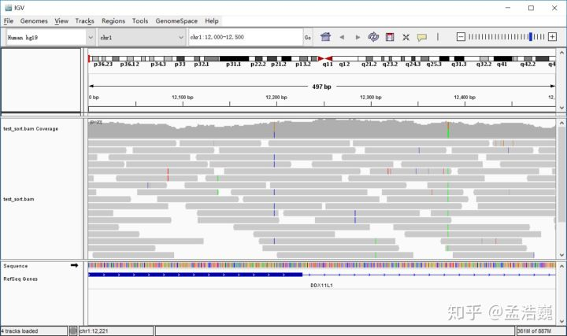

## 第29题 如何使用IGVTools对mapping结果进行可视化？
Hello 大家好，我们又见面了！
```python
目录
1. 前言
2. IGV Tools的简介；
3. IGV Tools的下载与安装；
4. IGV Tools的可视化初探（indel, mutation, etc）
```
### 1. 前言
我们为大家介绍了如何使用samtools tview对BAM文件在命令行中进行可视化的操作。但是有的时候我们需要在论文里对回贴（mapping）数据进行可视化.
这篇文章我们先来教大家下载安装并使用IGVTools对测序数据进行可视化；下一篇我们会教大家怎么用IGVTools来进行RNA-Seq数据的可视化。

### 2. IGV Tools的简介
IGV Tools =**Integrative Genomics Viewer Tools**

简单翻译一下就是基因组数据可视化工具，主要的功能就是对高通量测序数据的mapping结果进行可视化。IGV Tools是基于Java开发的，开发者是Broad Institute（伯德研究所），这个研究所可以算是当前生物医学领域最为牛的研究所之一，在他们的带动下推出了一系列的生物信息学工具，IGVTools，GATK都是他们搞出来的。

在IGV Tools中，可以对sorted BAM，BED，GTF/GFF，bigwig/wig，bedgraph等数据进行可视化，基本上是我们平时最常用可视化工具。无论是全基因组测序，RNA-Seq，ChIP-Seq等等都可以进行可视化。

IGV Tools的官方主页：

https://software.broadinstitute.org/software/igv/home


### 3. IGV Tools的下载与安装
IGV Tools是基于Java环境运行的，因此没有装Java的同学可能第一次安装这个软件之前需要先安装一遍，不过需要注意的是，根据IGV的安装说明，需要使用Java8，最新版的Java9还不能支持。

#### 3.1 Java 8 的下载与安装

下载地址https://java.com/zh_CN/download/


在这个页面里下载Java并安装就算是搞定了Java环境。

#### 3.2 下载IGV Tools

IGV Tools也有不同的版本我们一般选择最新版即可，目前的最新版是2.4版本。

下载地址 https://software.broadinstitute.org/software/igv/download

如果是Mac就选择下载1.Mac App，如果是Windows系统就选择2.Windows Zip，我们这里的演示环境为Windows就直接下载 对应版本即可。

#### 3.3 第1次运行IGV

在Mac中直接下载的文件就是个App直接双击就能运行。在Windows中，解压缩以后我们需要运行的是igv.bat。

双击igv.bat以后，第1次运行软件会自动下载注释需要的文件。需要注意的是，IGV每次使用的时候都需要在联网的环境下启动。

稍等片刻，就可以看到IGV的图形界面，到这里算是安装好了IGV Tools!

#### 4. IGV Tools的可视化初探
##### 4.1 基本介绍

最下方的注释信息为RefSeq Genes；

中间的空白部分是载入数据以后的可视化部分；

最上面的Human hg19 是选择参考基因组信息，需要与你载入的文件保持一致；

中间的空白栏是一个快速地搜索栏，可以搜索一个基因，比如TP53，可以是一个具体的坐标比如 chr1:10000-12000 然后点击Go就可以直接访问到该位置；

其他的地方的按钮，大家可以多点一点，多试一试自己探索一下功能。

#### 4.2 载入1个mapping的结果

需要注意的是，IGV Tools需要使用按坐标sort好的BAM文件并配合相应的BAM index才可以，而sort的办法我们上一个问题中刚刚给大家示范过，在这里就不再重复，直接给大家sort BAM 以及相应的index。
```
# BAM文件及BAM index文件
链接：https://pan.baidu.com/s/1YOv2FBwmPVKm2EG7TYl0jg 密码：m32y
```
BAM index文件的后缀名为bai，前缀需要与BAM文件保持一致，一般的命名规范为：
```
如果BAM文件名为：sorted.bam
那么bai文件名就应该是：sorted.bam.bai
且这两个文件应该放在同一个文件夹中。
```
在IGV中，选择 File -> Load From File -> 选择你下载好的sorted.bam文件，然后就会出现如图的界面。左边栏已经出现了2个track，分别是上面的coverage和下面比对情况，因为我们没有选择具体的genome region因此还不能显示详细信息。

我们在搜索栏里面写 chr1:12000-12500并点击Go以后，


图4 选择了某一个区域以后的的情况。
