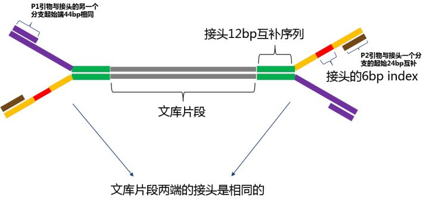

## 测序建库的adapter

Hello大家好！

上周我们已经把Illumina测序的基础内容基本搞清了，那么本周的问题我们主要是为围绕着测序后续的质控与建库细节来进行。

今天我们提出的问题是Illumina目前常用的双端测序建库办法中，会在打断的序列前后加上adapter，请问：

---

1. adapter是什么意思？adapter与primer有什么区别？

adapter在中文是适配器或者接口的意思，在前面的内容中已经提到将测序序列打碎成片断后要将末端补平然后添加adapter，用于与flowcell上的oligo匹配固定并为后续桥式PCR做准备，而前面提到的Index与adapter之间的位置关系一般为adapter1-Index-fragment-adapter2，adapter2通过与oligo互补连接在flowcell上，在进行完桥式PCR之后进行测序时，添加primer，这一段primer的序列是与Index互补的而非adapter1，所以最终拿到的测序结果应该是Index+fragment+adapter2或者Index+部分fragment

---

2. 比如最终的测序结果是 AATTCCGGATCGATCG…，那么adapter的序列可能出现在哪一端，还是两端都有可能出现？为什么？

一般出现在3’端，在上面第1题中已经说到，最终的测序结果应该是Index+fragment+adapter2或者Index+部分fragment，也就是说测序的方向是从5’到3’，adapter只可能出现在3’端。

---

参考资料：

a) 加adapter的示意图

b) Illumina测序视频
[生物信息学100个基础问题 —— 第3题 Illumina测序技术细节探究](https://zhuanlan.zhihu.com/p/34564457)
